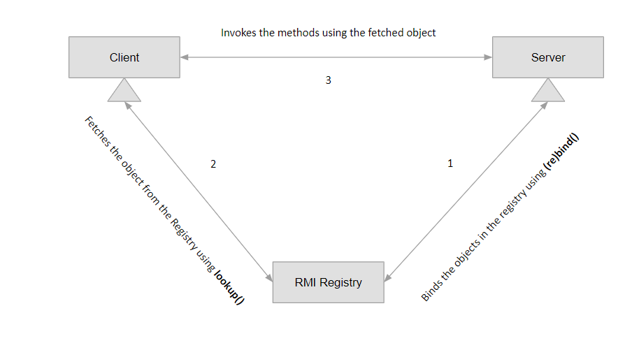
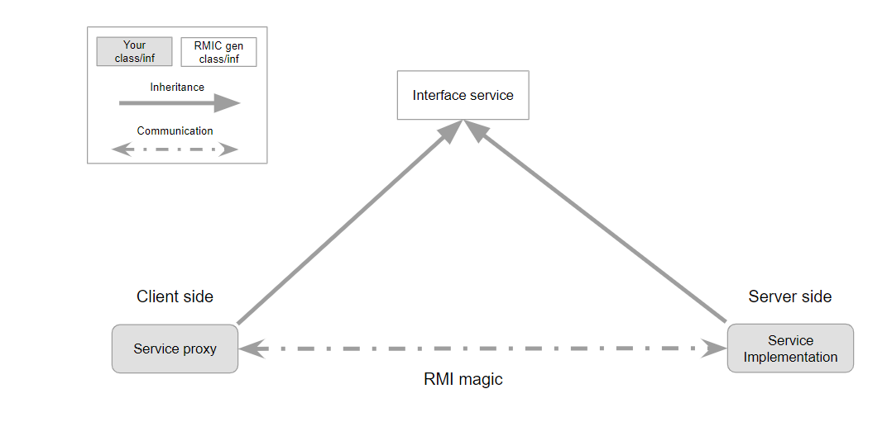
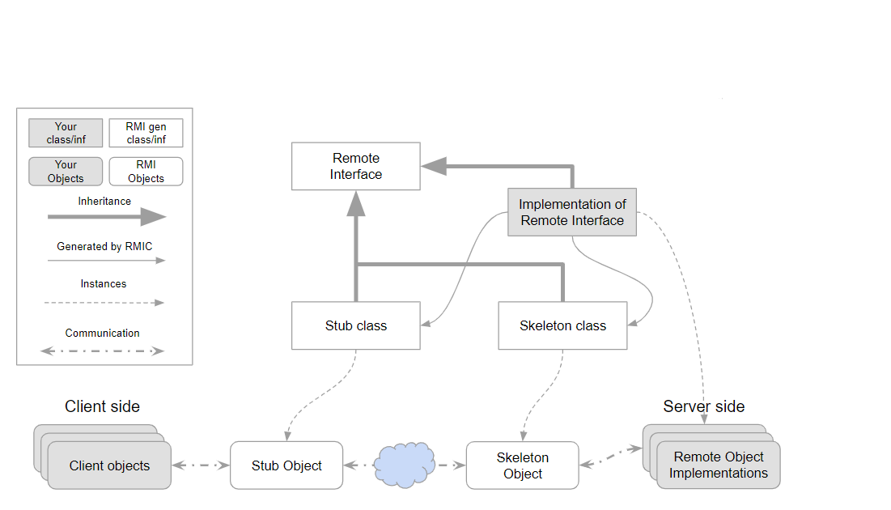
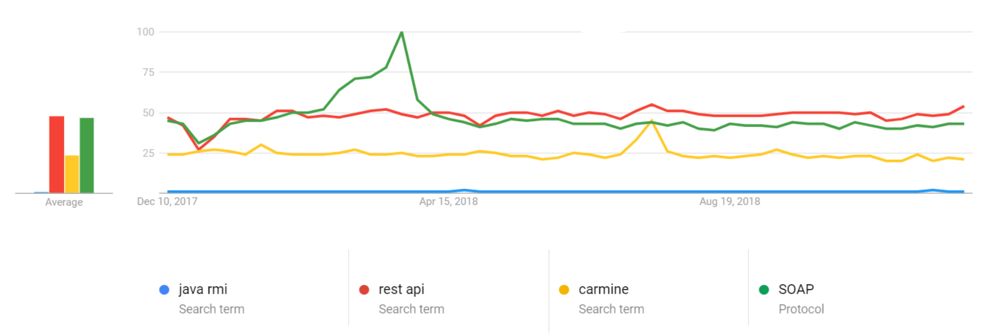

# Java RMI (Remote Method Invocation) usage example

## Introduction to RMI

The RMI (Remote Method Invocation) is an API that provides a mechanism to create distributed application in Java.
RMI (Remote Method Invocation) is a way that a programmer, using the Java programming language and development environment, can write object-oriented programming in which objects on different computers can interact in a distributed network.

### Expectations

In this reading we will taste a little bit of RMI, will see how to code it with two examples (simple and advanced-ish), and (spoiler alert, RMI is not dying, is already dead) give a modern alternatives in the conclusion.

### History

Response–request protocols date to early distributed computing in the late 1960s, theoretical proposals of remote procedure calls as the model of network operations date to the 1970s, and practical implementations date to the early 1980s. In the 1990s, with the popularity of object-oriented programming, the alternative model of remote method invocation (RMI) was widely implemented, such as in Common Object Request Broker Architecture (CORBA, 1991) and later, the Java Remote Method Invocation.

Remote Method Invocation was introduced with the 1.1 release of Java (February 1997). In J2SE 5.0 release on September 2004 the automatic stub generation for RMI objects was added.

RMIs in turn fell in popularity with the rise of the internet, particularly in the 2000s.

### RMI in general

The RMI enables delivery of data between 2 and more different applications (usually client-server) while using TCP under the hood without forcing you to "read bits" from the network. The Server publishes the methods that the Clients can be using. The Client receives these methods in a runtime and the remaining is magic.

#### The classic low-level model

- TCP connections using sockets
- Stream or object writing/reading

#### The RMI model

- Client calls methods on the Server
- Object Oriented
- Over TCP implementation, makes developer use methods, not low-level sockets and data management

### What using RMI looks and feels like

```
1. client calls some object's method
2. server's method gets invoked
```

#### Server.java

```java
public class Server {
  someMethod() {}
}
```

#### Client.java

```java
public class Client {
  Server obj = new Server();
  obj.someMethod();
}
```

### What it akchyually does

1. server binds the object in the registry, creating a skeleton
2. client looks up for the object and receives stub object (proxy)
3. client invokes stub's method
4. stub connects to the servers object's skeleton tcp
5. server's method gets invoked



## Architecture



- Remote Object
  - The server on which the methods will be invoked
  - Exports and implements interface (list of methods) for further remote invokations
  - And... that's it, you are good to go, without any sockets or data transportation management
- RMI Registry
  - Comes with standard Java Development Kit installation
  - Receives interface and connection details from the Remote
  - Usualy located in the same computer with the Remote
- Client
  - Receives Remote reference/proxy from RMI Registry (object that implements the interface over the
    network)
  - Calls methods that are implemented in that object

## How does it work under the hood



- The server implements a remote interface
- Stub and skeleton being compiled
  - The stub (client side) hides the serialization of parameters and the network-level communication in order to present a simple invocation mechanism to the caller
  - The skeleton (server side) is responsible for dispatching the call to the actual remote object implementation
- The server binds methods in the RMI registry (calls the registry to associate a name with a remote object)
- RMI registry publishes proxy
- The client looks up the remote object by its name in the server's registry and then invokes a method on it
- The proxy implements and invokes method on the Remote
- The RMI layer on the Remote listens and receives the invocation and calls the relevant method of
  the Remote Object
- The RMI layer returns a response to the Client

## Same thing but with code example

The following application's code is an example of RMI interraction between the Client and the Server. In this simple implementation we are going to tell to the Server how many times we want it to say "Hello" and to report to us when it's done.

### RMIServer.java

```java
package io.github.guzzur.rmiserver;

import java.rmi.Naming;
import java.rmi.RemoteException;
import java.rmi.registry.LocateRegistry;
import java.rmi.registry.Registry;
import java.rmi.server.UnicastRemoteObject;

import io.github.guzzur.rmiinterface.RMIInterface;

public class RMIServer extends UnicastRemoteObject implements RMIInterface {
    private static final long serialVersionUID = 1L;

    protected RMIServer() throws RemoteException {
        super();
    }

    @Override
    public String sayHello(int times) throws RemoteException {
        for (int i=0; i < times; i++)
            System.out.println(i+1 + ") Hello!");
        System.out.println("Server said hello " + times + " times");
        return "Server said hello " + times + " times";
    }

    public static void main(String[] args){
        try {
            // In that example the registry runs within the server app
            Registry reg = LocateRegistry.createRegistry(1099);

            Naming.rebind("//localhost/RMIServer", new RMIServer());
            System.out.println("Server ready");
        } catch (Exception e) {
            System.err.println("Server exception: " + e.toString());
            e.printStackTrace();
        }
    }
}
```

### RMIInterface.java

```java
package io.github.guzzur.rmiinterface;

import java.rmi.Remote;
import java.rmi.RemoteException;

public interface RMIInterface extends Remote {
    public String sayHello(int times) throws RemoteException;
}
```

### RMIClient.java

```java
package io.github.guzzur.rmiclient;

import java.net.MalformedURLException;
import java.rmi.Naming;
import java.rmi.NotBoundException;
import java.rmi.RemoteException;

import io.github.guzzur.rmiinterface.RMIInterface;

public class RMIClient {
    private static RMIInterface lookUp;

    public static void main(String[] args)
            throws MalformedURLException, RemoteException, NotBoundException {
        lookUp = (RMIInterface) Naming.lookup("//localhost/RMIServer");
        int times = 5;
        // Woila! Now we can use sayHello method!
        String response = lookUp.sayHello(times);
        System.out.println(response);
    }
}
```

### Result

```
/* SERVER */
1) Hello!
2) Hello!
3) Hello!
4) Hello!
5) Hello!
Server said hello 5 times

/* CLIENT */
Server said hello 5 times
```

## Passing objects via RMI

From https://docs.oracle.com/javase/8/docs/platform/rmi/spec/rmi-objmodel7.html

> ### Passing Non-remote Objects
>
> A non-remote object, that is passed as a parameter of a remote method invocation or returned as a result of a remote method invocation, is passed _by copy_; that is, the object is serialized using the object serialization mechanism of the Java SE platform.
>
> So, when a non-remote object is passed as an argument or return value in a remote method invocation, the content of the non-remote object is copied before invoking the call on the remote object.
>
> When a non-remote object is returned from a remote method invocation, a new object is created in the calling virtual machine.
>
> ### Passing Remote Objects
>
> When passing an exported remote object as a parameter or return value in a remote method call, the stub for that remote object is passed instead. Remote objects that are not exported will not be replaced with a stub instance. A remote object passed _as a parameter_ can only implement remote interfaces.

## The future of RMI

### RMI on Android

Java.RMI unfortunately does not come with Android and therefore it's not possible to use it

### Security

The biggest problem that I've found is that the RMI uses pure Serializable implementations, which is a "horrible mistake" due to Oracle:

From https://www.infoworld.com/article/3275924/java/oracle-plans-to-dump-risky-java-serialization.html

> #### Oracle plans to dump risky Java serialization
>
> A “horrible mistake” from 1997, the Java object serialization capability for encoding objects has serious security issues

### Alternatives

#### RMI vs REST vs Carmine (new Java alternative for RMI) vs SOAP



One picture says it all.

## In conclusion

The RMI library has not changed since 2004. Even the Carmine, the alternative, hasn't changes since 2014. Looks like the REST, SOAP and other language independent approaches have won this battle.
