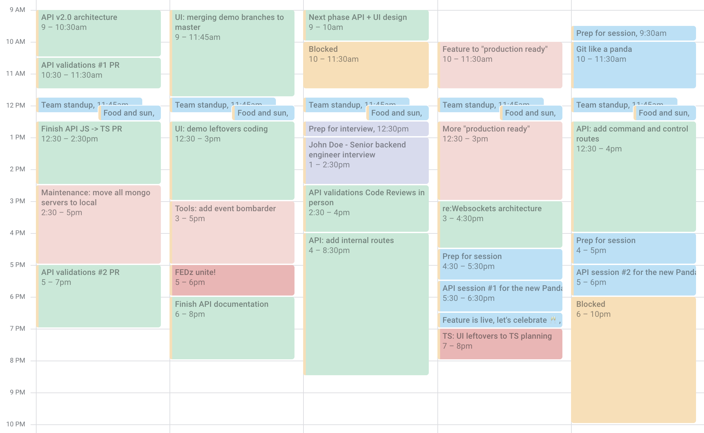
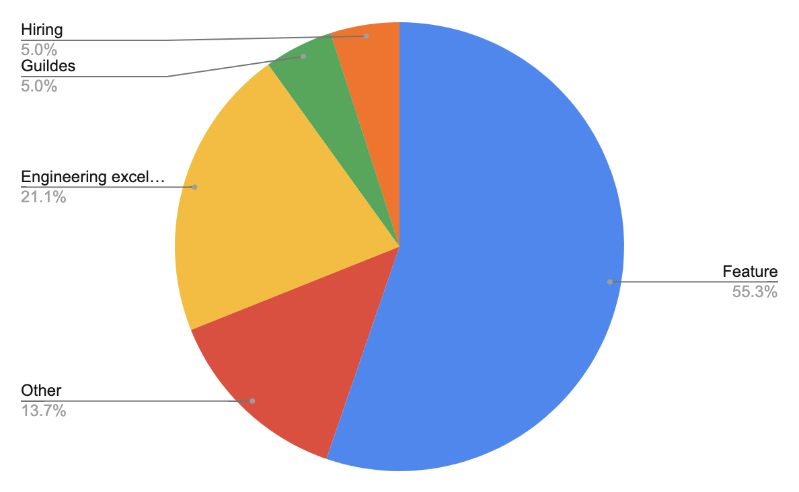
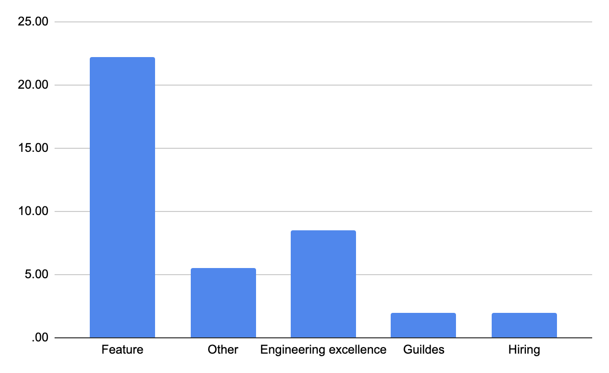
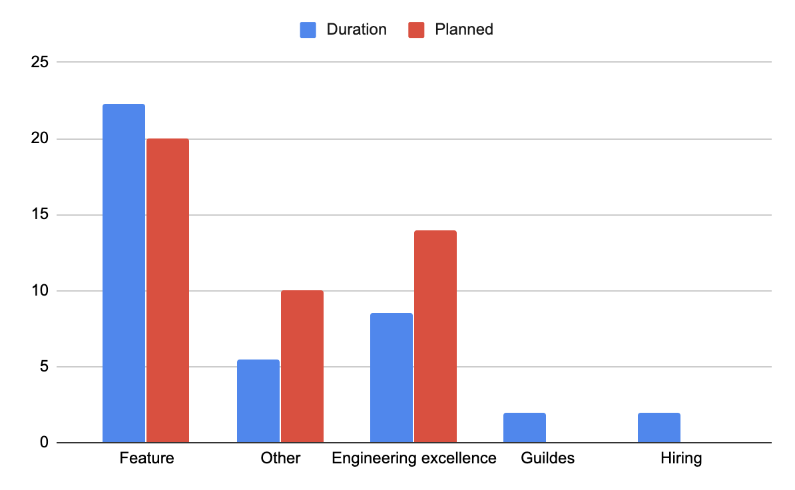

# Visualize your time in 2 simple steps or how to dump data from Google Calendar to Sheets

I work in a data and metrics driven organization named [bigpanda.io](https://bigpanda.io) as a senior fullstack developer, position that comes with a lot of responsibilities and contexts.

So it felt just right to measure how and what exactly I spend my time on. But measuring itself is not enough, so I decided to visualize this data so I could improve my focus on the right things from week to week, learning from the past.

This is also my first public blog post ever, so please tear it apart! I’m happy to hear your suggestions on how to improve my writing.

## Prerequisites

Here's the list of prerequisites needed to be able to get your week's schedule dumped. Your week should look something like this dummy calendar:



### Google account

We will read the data from calendar to sheets

### Discipline

- Everything you do must be reflected in your calendar. **Everything**.
- React to each event: **Accept** or **Decline** (**Maybe** is ok too)
- Mark events with color, grouped by project/context (optional, will help to visualize)


Are you still here? Cool, let's do it!

## Step 1: Dump calendar data

- Create new Google Sheet (let's call it `GCal_to_GSheets`)
- Rename its active (and only) sheet: `Sheet1` -> `data`
- Add script
  - In your spreadsheet got to Tools -> Script editor
  - Rename the project to something like `GCal_to_GSheets`
  - Add the following code, replace
    - `myCal`
    - `start`
    - `end`

```js
function export_gcal_to_gsheet() {
  var numOfCols = 8;
  var mycal = "xyz@gmail.com";
  var start = "2020-04-26";
  var end = "2020-04-30";
  var cal = CalendarApp.getCalendarById(mycal);
  var events = cal.getEvents(new Date(start), new Date(end));
  
  var sheet = SpreadsheetApp.getActiveSheet();
  
  // If you remove it, it will append the data with each run
  sheet.clearContents();
  
  // My personal events I prefer to skip
  var skipEvents = [
    "EOD",
    "AFK",
    "Blocked"
  ];
  // You will need to debug a little to set
  // your color to project map right
  var projects = {
    '1': 'Hiring',
    '2': 'Feature',
    '4': 'Engineering excellence',
    '7': 'Other',
    '11': 'Guildes'
  }
  var header = [[
    "Title",
    "Start",
    "End",
    "Duration",
    "Status",
    "Created by",
    "Project",
    "Project ID"
  ]];
  var range = sheet.getRange(1,1,1,numOfCols);
  range.setValues(header);
  
  var myformula_placeholder = '';
  var row = 2;
  for (var i = 0; i < events.length; i++) {
    var skip = false;
    for (var j = 0; j < skipEvents.length; j++) {
      if(skipEvents[j] === events[i].getTitle()) {
        skip = true;
      }
    }
    if(!skip && !(events[i].getMyStatus() == 'NO') && !((events[i].getMyStatus() == 'MAYBE'))) {
      var color = events[i].getColor();
      var details = [[
        events[i].getTitle(),
        events[i].getStartTime(),
        events[i].getEndTime(),
        myformula_placeholder,
        events[i].getMyStatus(),
        events[i].getCreators(),
        color && projects[color],
        color
      ]];
      var range = sheet.getRange(row,1,1,numOfCols);
      range.setValues(details);

      var cell=sheet.getRange(row,4);
      cell.setFormula('=(HOUR(C' +row+ ')+(MINUTE(C' +row+ ')/60))-(HOUR(B' +row+ ')+(MINUTE(B' +row+ ')/60))');
      cell.setNumberFormat('.00');
      row++;
    }
  }
}
```

- Run it (Run -> Run function -> `export_gcal_to_gsheet`)
- Authorize in the popping up window
- Wait, aaaand... done

## Step 2: Visualize

Add dashboard sheet, let's call it `dashboard`, and add some charts

### Visualization ideas

#### Time per project - percentage



- **Data range**: `data!A1:H100`
- **X-axis**: `Project`
- **Aggregate**: `true
- **Series**: `Duration`

#### Time per project - column



- **Data range**: `data!A1:H100`
- **X-axis**: `Project`
- **Aggregate**: `true
- **Series**: `Duration`

#### Planned vs actual

You can add another sheet where you manage your time consumption expectations (weekly / bi-weekly). This data can be dumped from Jira or whatever project management software you use.



- **Data range**: `data!A1:H100,planned!A2:B100`
- **X-axis**: `Project`
- **Aggregate**: `true
- **Series**: `Duration,Planned`

## Did I mention that we're hiring?

No?! Please check out [our open positions](https://www.bigpanda.io/company/careers/).
